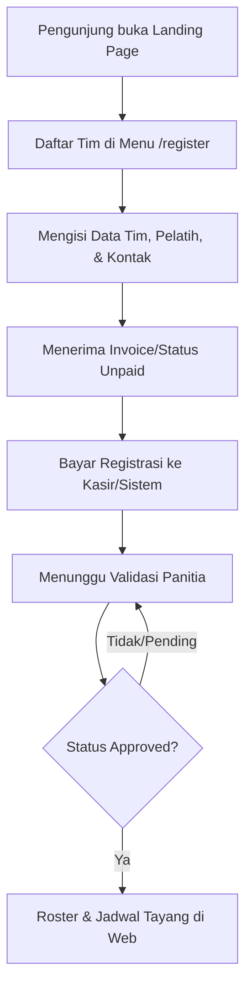
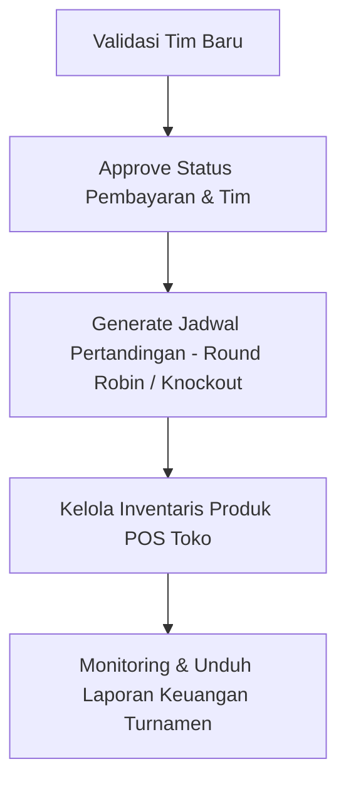
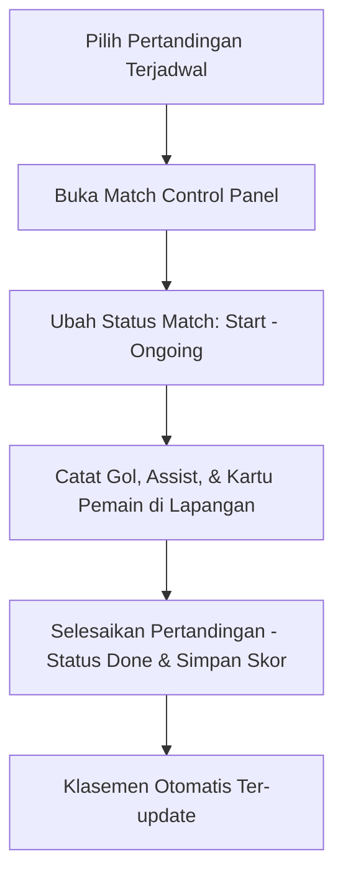
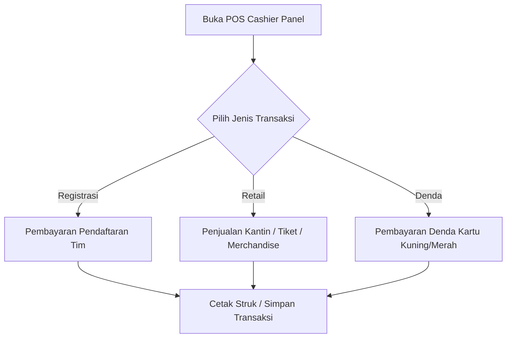

# Project Workflow: TrophyHub (Sistem Manajemen Turnamen Olahraga)

Alur kerja (workflow) sistem TrophyHub dirancang terintegrasi berdasarkan masing-masing peran (role) pengguna, baik pengguna publik maupun petugas internal (Admin, Wasit, Kasir).

---

## 1. Alur Kerja Publik / Tim Pendaftar

Pengunjung umum atau perwakilan tim berinteraksi melalui aplikasi frontend React.

* **Pendaftaran Tim Mandiri:** Mengisi detail tim, nama pelatih, kontak, dan jenis olahraga (Futsal).
* **Pemantauan Roster & Jadwal:** Setelah divalidasi, tim dapat mengunggah daftar pemain (roster) dan melihat jadwal pertandingan mereka di halaman `/matches`, posisi klasemen di `/standings`, atau posisi bagan di `/bracket`.

---

## 2. Alur Kerja Admin / Panitia (Role: `admin`)

Admin memiliki kendali penuh di backend untuk mengoordinasi dan memantau turnamen.

* **Manajemen Petugas:** Membuat dan mengaktifkan akun untuk Wasit dan Kasir di menu `/admin/users`.
* **Persetujuan Tim:** Memeriksa tim masuk di `/admin/teams`. Jika pembayaran registrasi valid, admin mengubah status menjadi `approved`.
* **Pembuatan Jadwal (Fixture Generator):** Menggunakan menu `/admin/fixtures` untuk meng-generate jadwal pertandingan (secara otomatis menggunakan algoritma *Round-Robin* liga atau *Knockout* bagan gugur) untuk semua tim yang berstatus `approved`.
* **Inventaris POS:** Mengelola katalog barang (stok dan harga makanan/minuman/merchandise) di menu `/admin/pos/products`.
* **Pelaporan & Audit:** Mengakses menu `/admin/laporan` untuk memantau grafik pendapatan harian serta mengunduh rincian laporan keuangan (kombinasi biaya registrasi, penjualan retail, dan denda).

---

## 3. Alur Kerja Wasit (Role: `wasit`)

Wasit bertanggung jawab langsung atas jalannya pertandingan di lapangan dan pencatatan statistik permainan.

* **Persiapan Roster Pemain:** Memverifikasi daftar pemain/roster tiap tim di `/admin/teams/{id}/players`.
* **Kontrol Pertandingan:** Mengakses `/admin/matches` lalu membuka **Match Control Panel** (`/admin/matches/{id}/control`) saat pertandingan dimulai untuk mengubah status menjadi `ongoing` secara real-time.
* **Input Statistik:** Menggunakan panel statistik (`/admin/matches/{id}/statistics`) untuk mencatat gol, *assist*, kartu kuning, atau kartu merah per pemain.
* **Finalisasi Match:** Setelah peluit panjang, wasit mengubah status pertandingan menjadi `done`. Skor akhir akan secara otomatis memperbarui tabel klasemen liga (`/admin/standings`).

---

## 4. Alur Kerja Kasir (Role: `kasir`)

Kasir mengelola seluruh transaksi keuangan tunai/on-site di lokasi turnamen.

* **Pembayaran Registrasi:** Membantu tim peserta menyelesaikan biaya administrasi pendaftaran turnamen agar statusnya dapat diubah menjadi *approved* oleh admin.
* **Penjualan Retail (Kantin/Merchandise):** Melayani pembelian makanan, minuman, kaos turnamen, atau tiket masuk fisik pengunjung melalui menu `/admin/pos`. Stok barang di `PosProduct` akan berkurang otomatis.
* **Penagihan Denda Pelanggaran:** Memproses pembayaran denda kartu (kuning/merah) yang dikenakan kepada pemain berdasarkan laporan statistik pertandingan dari wasit.
* **Katalog Produk:** Membuka menu `/admin/pos/products` (read-only) untuk memantau sisa stok barang dan harga jual yang berlaku.
